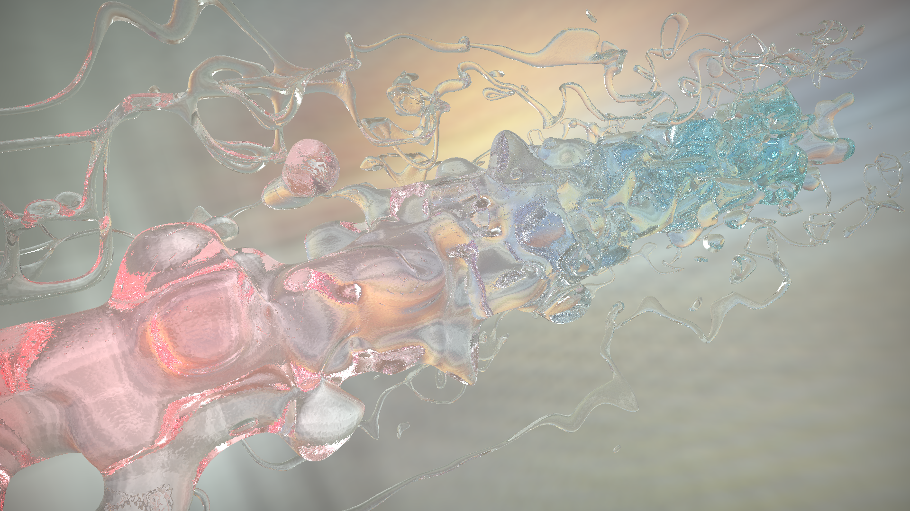

# Unity-Raymarching-Glass
Based on [this shader](https://www.shadertoy.com/view/ttl3R2). I think there are many turoials on how to implement Shadertoy's shaders in Unity. But I couldn't really find any clear resource explaining how to cope with GLSL's ``texelfetch``. This was particularly true when it came to `sampler3D`. Accorrding to [this thread](https://forum.unity.com/threads/what-is-glsls-texelfetch-in-unitys-unlit-shader.639757/) on the Unity forum, it seems that you have a few options to handle this conversion. For me, ``Texture3D.Load()`` was the only functional method this time.

In addition, you need to create a 3D noise texture via script, unlike Shadertoy.It is the equivavlent of the volume input of ``RGBA Noise3D`` on Shadertoy. I found [this example](https://docs.unity3d.com/Manual/class-Texture3D.html) quite helpful.

[Video](https://youtu.be/RWvpcSv4NBo)
